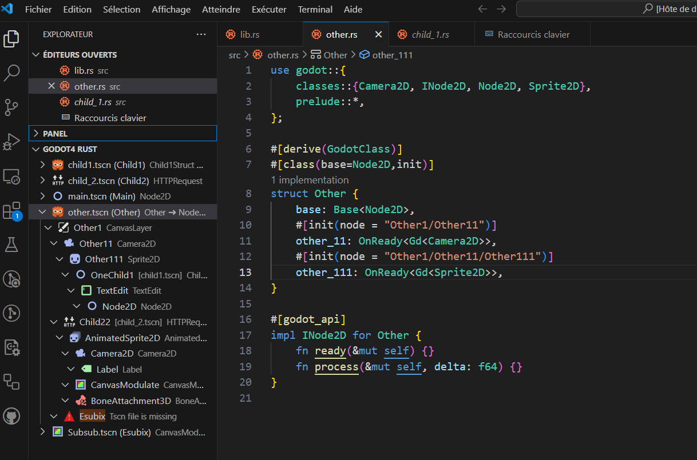
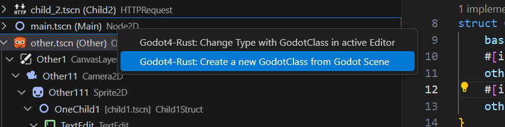
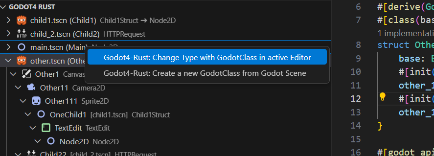
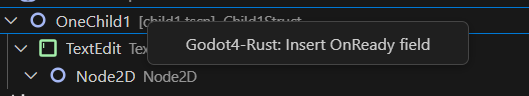
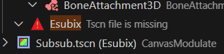
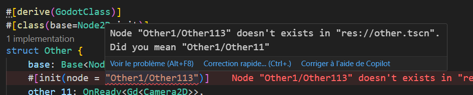

<h1 align="center">

Godot4 Rust

</h1>

This extension aims to add a smoother experience using Rust with Godot

## Features

[**Nice `side panel` showing your project's scenes**](#scenes-panel)

[**Add `OnReady` as simple as in Godot**](#add-onready-as-simple-as-in-godot)

[**`Easy quick Derive` new rust GodotClass from existing `Godot Scene`**](#derive-new-rust-module-from-existing-godot-scene)

[**Full project `kickstart` in one command**](#first-you-need-to-configure-the-linked-godot-project)

[**`Lint your code` and search for invalid node path/missing scene**](#code-linter)

[**Switch Godot Node by you Rust GodoClass**](#switch-godot-class-by-rust-godot-class)

[**Create .gdextension file**](#create-gdextension-in-your-godot-project)

[**Less boilerplate and speed up your worflow**]

## Usage

> [!IMPORTANT]
> First you need to configure the linked Godot Project

command: `Godot4-Rust: Set Godot Project`

Use dedicated command to set it (Ctrl+Maj+P => Godot4-Rust: set Godot Project)

#### Scene's Panel

Your scenes are shown with the following format:

- godot base scene: Godot Icon, Scene pathe, (Rootnode), base type
- rust godotclass based scene: `ferris` icon, Scene path, (RootNode name), GodotClass name -> baseclass

##### actions

via Right mouse click, context menu:

###### on Root Nodes

- [**`Easy quick Derive` new rust GodotClass from existing `Godot Scene`**](#derive-new-rust-module-from-existing-godot-scene)
  

- [**Switch Godot Node by you Rust GodoClass**](#switch-godot-class-by-rust-godot-class)
  

##### on child Nodes

- [**Add `OnReady` as simple as in Godot**](#add-onready-as-simple-as-in-godot)

https://github.com/user-attachments/assets/414b2b24-9177-4bed-8c98-b75a78f8f88f

#### Add `OnReady` as simple as in Godot

command: `godot4-rust.insertOnReady`

- Adds fields automagically with correct Type and name. Struct must be [`init`](https://godot-rust.github.io/docs/gdext/master/godot/register/derive.GodotClass.html#construction)

https://github.com/user-attachments/assets/4a9904bf-6ff1-4570-8b82-b015ea439fd4

#### Derive new rust module from existing Godot Scene

command: `Godot4-Rust: Create a new GodotClass from Godot Scene`

- by right clicking the panel or just run the command `Create new godot class from scen`
- Select and existing Godot Scene from you project
- You can choose to create a new rust module or use the active one (will add `mod mymodule` if needed)
- Pick `Godot Methods` and `OnReady` you want to add
- here you are !!!
- There is in option to choose to automaticaly switch the type in godot scene.

https://github.com/user-attachments/assets/af8f9d93-9528-4980-8b57-63ca8d41cbf7

#### Less boiler plate and speed up workflow

##### Kickstart a new project

command: `Start new godot rust project`.

- select project.godot file, crate name and path
- you get:
  - New rust project
  - configured Cargo.toml for last version of godot-rust
  - workspace settings: godot project and [rust analyzer check command updated](#rust-analyzer-check-command-updated)
  - lib.rs with ExtensionLibrary

##### Rust Analyzer Check Command updated

command: `Godot4-Rust: Use 'build' as Rust Analyzer check command`

Set worksapce settings so RA, uses build instead of check as check command. So your project is always compiled. Same parameters are given, only check is replaced by build

#### Code Linter

An error will be raised in panel if a godoclass or child scene is missing.

An error will be shown in code if node path doesn't exists for onready fields.

#### Create .gdextension in your Godot Project

command: `godot4-rust.createGdextension`

- First: Be sure to have run **Set Godot Project** command
- Second: Run command **Godot4-Rust: Create a the .gdextension file in your project**, and that's it.

By default `compatibility minimum` is set following the value of your godot.project file.

#### Switch Godot class by Rust godot class

command: `godot4-rust.replaceBaseClass`

In place modify your scene, to use godot class in active editor.

## Extension Settings

This extension contributes the following settings:

- `godot4-rust.godotProjectFilePath`: REQUIRED: selected the .godot project file. Use dedicated command to set it (Ctrl+Maj+P => Godot4-Rust: set Godot Project). It sets workspace only.

## Known Issues

- Rust Analyzer is not mandatory but warmly suggested (autoimport, autobuild)
- Only accept one godot class by rust module

## Contribute

## Thanks

- rust godot team
- godot-vscode extension for inspiration and icons

## Release Notes

### 0.1.0

Initial release
